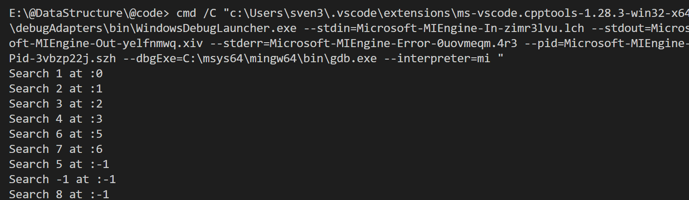
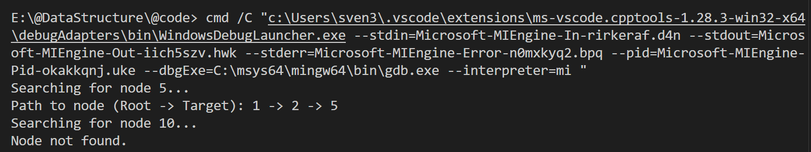
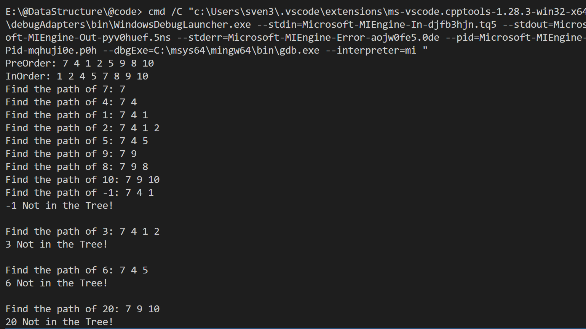

# 数据结构——第七章作业

**编程环境**：Windows11 vscode MinGW64 C++14

## problem 7-3

### 题目描述

试将折半查找的算法改成递归算法。

### 算法设计思路

折半查找（二分查找）的基本思想是在有序序列中，每次取中间元素与目标值进行比较。如果相等则查找成功；如果目标值小于中间元素，则在左半部分继续查找；如果目标值大于中间元素，则在右半部分继续查找。

将其改为递归算法，主要步骤如下：
1.  **函数定义**：定义递归函数 `find(vec, x, begin, end)`，其中 `begin` 和 `end` 指定当前查找的区间范围。
2.  **计算中间位置**：`mid = begin + (end - begin) / 2`。
3.  **递归终止条件（基准情况）**：
    *   当 `begin >= end` 时，区间缩小到一个元素或无效。此时检查 `vec[mid]` 是否等于 `x`。如果是，返回 `mid`；否则返回 `-1` 表示未找到。
4.  **递归步骤**：
    *   如果 `vec[mid] > x`，说明目标值在左半区间，递归调用 `find(vec, x, begin, mid - 1)`。
    *   如果 `vec[mid] < x`，说明目标值在右半区间，递归调用 `find(vec, x, mid + 1, end)`。
    *   如果 `vec[mid] == x`，为了处理可能的重复元素（或找到最左侧的匹配），本实现选择继续在左侧闭区间递归 `find(vec, x, begin, mid)`，直到触发基准情况。

### 测试与结果

对数组 `{1, 2, 3, 4, 4, 6, 7}` 进行测试：



## problem 7-5

### 题目描述

设二叉树采用二叉链表表示，指针 root 指向根结点。试编写一个在二叉树中查找值为 x 的结点，并打印该结点的所有祖先结点的算法。在此算法中，假设值为 x 的结点不多于一个。

针对此题，提供了两种解法：
1.  针对**普通二叉树**的通用解法。
2.  针对**二叉排序树（BST）**的优化解法。

### 解法一：普通二叉树 (Chapter7_5_not_sorted.cpp)

#### 算法设计思路

对于无序的普通二叉树，无法利用节点值的大小关系来剪枝，必须进行遍历（通常是深度优先搜索 DFS）。

1.  **数据结构**：使用 `std::stack` 来记录从根节点到当前节点的路径。
2.  **递归逻辑**：
    *   编写递归函数 `foundNodeRecursive(node, target, path)`。
    *   每次进入节点，先将该节点压入栈 `path.push(node->data)`。
    *   **检查**：如果当前节点值等于 `target`，说明找到了，返回 `true`。
    *   **递归**：如果没找到，依次递归调用左子树和右子树。
    *   **回溯**：如果左右子树都没有找到目标节点，说明当前节点不在目标路径上，执行 `path.pop()` 将当前节点弹出栈，并返回 `false`。
3.  **结果**：如果函数返回 `true`，此时栈中保存的正是从根节点到目标节点的路径（即所有祖先 + 目标节点）。

#### 测试与结果

构建如下二叉树：
```text
      1
    /   \
   2     3
  / \     \
 4   5     6
```
查找目标：`5`， `10`。

输出结果：



### 解法二：二叉排序树 (Chapter7_5_sorted.cpp)

#### 算法设计思路

如果二叉树是二叉排序树（BST），则可以利用其性质（左子树 < 根 < 右子树）将时间复杂度从 O(N) 降低到 O(H)（H为树高）。

1.  **查找逻辑**：
    *   从根节点开始遍历。
    *   每访问一个节点，直接输出该节点的值（因为在 BST 中，查找路径是唯一的，路径上的所有节点即为祖先）。
    *   如果 `x < node->data`，向左子树移动。
    *   如果 `x > node->data`，向右子树移动。
    *   如果 `x == node->data`，查找成功，结束。
2.  **优势**：不需要回溯，不需要额外的栈空间存储路径，边查找边输出。

#### 测试与结果

构建二叉排序树，插入序列：`7, 4, 9, 1, 5, 8, 10, 2`。

测试输出如下：



