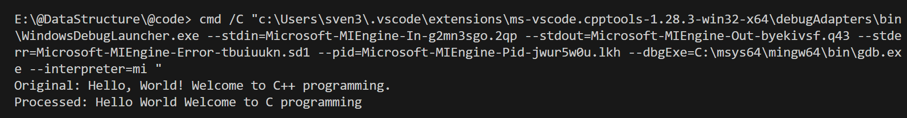
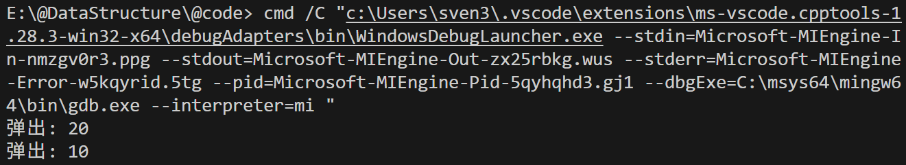

# 数据结构——第三、四章作业

**编程环境**：Windows11 vscode MinGW64 C++14

---
## 第三章第3问

### 题目描述

编写一个函数，从string对象中去掉标点符号。要求输入到程序的字符串必须含有标点符号，输出结果则是去掉标点符号后的string对象。

### 解题思路

逐个字符扫描，遇到标点符号跳过，遇到非标点复制到新字符串
时间复杂度：O(N)
空间复杂度：O(N)

总体而言这个解法的时间复杂度和空间复杂度都还不错，同时也比较便于理解。

### 测试与结果

```cpp
int main() {
    string input = "Hello, World! Welcome to C++ programming.";
    RemovePunctuation remover(input);
    string output = remover.process();
    cout << "Original: " << input << endl;
    cout << "Processed: " << output << endl;
    return 0;
}
```



---
## 第四章第2题

### 题目描述

用栈求表达式 $a-b*(c+d)/e+5$ 的值，请给出运算符栈和操作数栈的变化过程。

### 解题思路

本题最关键的是分析中缀表达式的求值过程：

#### 数据结构：
我创建了一个 `Expression` 类，其中最核心的是 `string expr` 记录当前表达式值， `stack<int> values` 和 `stack<char> ops` 分别是操作数栈和运算符栈；
同时还设计了 `void showStacks()` 用于输出两个栈中的元素， `int applyOp(int a, int b, char op)` ， `int precedence(char op)` 用于判断操作符优先级。

#### 计算过程：
遍历 `string expr`，根据 `expr[i]` 分为4类：

1. `expr[i]` 是数字：

数字进操作数栈
这里要注意多位数，所以读到数字后要继续往后遍历直到读到非数字为止。

2. `expr[i]` 是左括号 `(`:

左括号进操作符栈

3. `expr[i]` 是右括号 `)`:

弹出操作符栈，直到遇到左括号为止;
如果操作符不是左括号，那么弹出两位操作数，调用 `applyOp(a, b, op)` 函数计算得出运算后结果 `res`，之后 `res` 入栈

4. `expr[i]` 是操作符：

判断 `expr[i]` 操作符的优先级以及栈顶操作符的优先级。

如果栈顶操作符运算优先级更高（体现为 `precedence(ops.top()) <= precedence(expr[i])` ）:
先进行栈顶的操作，之后判断下一位操作符的优先级，同理，直到遇到优先级更低的操作符。

需要注意的是，在遍历完 `expr` 后，要把剩下的运算做完，最终 `values.top()` 就是想要的答案

时间复杂度：O(n)
空间复杂度：O(n)

### 测试与结果

```cpp
int main()
{
    int a = 10, b = 2, c = 3, d = 4, e = 7;
    // cin >> a >> b >> c >> d >> e;
    string input = getExpression(a, b, c, d, e);
    Expression expression(input);
    int result = expression.solve();
    cout << "Expression: " << input << endl;
    cout << "Result: " << result << endl;
    return 0;
}
```

最终结果见[第四章第7题运算结果](Chapter4_7.txt)：`Chapter4_7.txt`

---
## 第四章第8题

### 题目描述

用链表实现栈，请给出栈的数据结构声明，出栈和入栈函数。

### 解题思路

使用链表实现栈，每个节点包含数据和指向下一个节点的指针。栈顶指针指向链表的头部。

#### 数据结构：
我定义了一个模板类 `MyStack<Type>`，内部使用结构体 `Node` 存储数据和下一个节点的指针。`top` 指针指向栈顶，`length` 记录栈的大小。

#### 入栈操作：
`push` 函数创建一个新节点，将数据存储在新节点中，新节点的 `next` 指向当前 `top`，然后更新 `top` 为新节点，并增加 `length`。

#### 出栈操作：
`pop` 函数首先检查栈是否为空，如果为空抛出异常。否则，保存当前 `top` 的数据，更新 `top` 为 `top->next`，删除原 `top` 节点，减少 `length`，返回数据。

时间复杂度：入栈和出栈都是 O(1)
空间复杂度：O(n)，n 为栈中元素个数

### 测试与结果

```cpp
int main()
{
    MyStack<int> stack;
    stack.push(10);
    stack.push(20);
    cout << "弹出: " << stack.pop() << endl;
    cout << "弹出: " << stack.pop() << endl;
    return 0;
}
```



