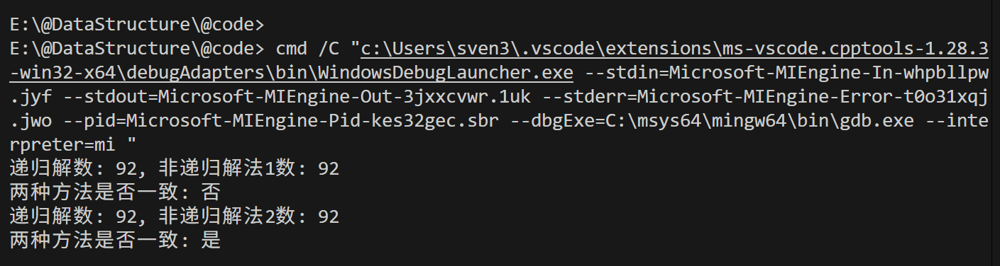

# 数据结构——第五章作业

**编程环境**：Windows11 vscode MinGW64 C++14

---
## 八皇后问题递归解决

设计一个递归函数，求解八皇后问题（在 8×8 的棋盘上放置 8 个皇后，使她们不能互相攻击，即任意两个皇后不能处于同一行、同一列或同一斜线上），要求输出所有可能的解。

### 解题思路
与ppt上讲述的一致；

### 实现过程

定义了封装函数与递归函数便于理解：

```cpp
// 使用递归函数求解八皇后问题(求出所有解)
// 封装函数
vector<vector<string>> solveWrapping(int);
// 递归函数
void solveRecursive(vector<vector<string>> &res, vector<string> &grid, vector<int> &used, int n);
```

在每次递归的过程中，我传入 `res` 记录所有的结果、当前的棋盘 `grid`、已经放过皇后的列 `used`，以及当前行 `n`；
当 `n == grid.size()` 时，递归走到了最后一行，把当前棋盘复制入 `res`；对于一般的情况，遍历 `used` 如果当前列之前还没有放过皇后，则维护 `used` 和 `grid` 进入下一层递归；

最后在 `main` 函数中将所有结果输出。

---

## 八皇后问题的非递归解决（1）

将上述递归函数转化为非递归函数（使用栈模拟递归过程），完成相同功能。验证两种方法的解是否一致。

### 解题思路

在每层递归的时候，需要传入的参数是 `grid`、`used`以及当前行数 `n`；
所以，在转化为非递归的时候，需要使用栈记录这三个参数。

构建 `struct State` 这一结构体记录这三个参数；使用 `stack<State> callStack` 记录压栈过程；

此时循环逻辑变成了： `callStack` 中有元素，弹出 `top()`，接下来的判断逻辑与递归解决方案接近；

### 思考

使用这种方法模拟递归过程虽然实现了相同的功能，找到了所有的解，但是，这种方法的解的顺序与递归调用不一致。导致这个结果的原因是因为：递归时，递归树的兄弟分支不会“同时进栈”，而是当前子分支整棵子树走完才回到兄弟。而非递归把兄弟分支都提前压进了同一个栈中，它们彼此的先后由“压栈顺序的逆序”决定，从而全局解的出现顺序也随之改变。
非递归版本使用栈，由于栈后进先出的性质导致了遍历顺序与递归版本相反。另外，每一次记录都要拷贝一份 `grid` 和 `used` 对空间占用极大，也不符合原来递归思路中传引用与回溯的思想。接下来的解法我将尽可能解决这个两个问题。

---

## 八皇后问题的非递归解决（2）

### 解题思路

在上一种解决方案中，我们发现每一层递归传入的参数是 `grid`、`used` 以及当前行数 `n`，这是对的，但是并没有触及问题的本质，`grid` 和 `used` 只是在不断地被修改、维护，而不是一次次地被拷贝。因此每一层递归中更本质的应是当前的行数、列数以及是否需要回溯。

回溯判断：
每当对 `grid` 和 `used` 做了修改并进入下一层循环时就应该把 `returning` 标记为 `true` 表示需要回溯；
每当做完回溯操作之后，当前 `State` 就不需要再回溯 `returning` 标记为 `false`；

`State` 出栈判断：
1. 找到了最终结果，出栈；
2. 对于所有 `!used` 都无法找到合法的结果，出栈；

### 实现过程

初始化：
```cpp
    vector<vector<string>> res;
    vector<string> grid(n, string(n, '0'));
    vector<int> used(n);

    struct State
    {
        int row, i;
        bool returning;
    };

    stack<State> callStack;
    callStack.push({0, 0, 0});
```
当栈非空时，拿出栈顶的引用，判断是否是合法的最终解？是的话就复制入 `res`，弹出栈，进入下一层循环；否则，首先看是否需要回溯，接下来找到下一个可能合法的解。如果没找到，出栈，找到了那么更新 `used` 和 `grid`，新状态入栈；

## 最终的结果：

