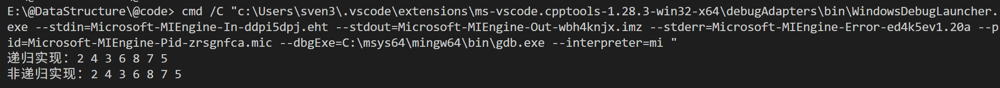
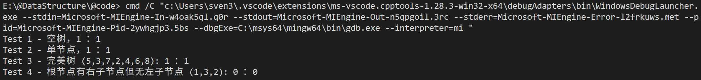
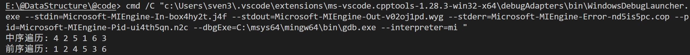
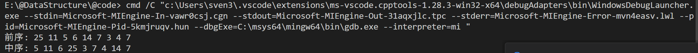
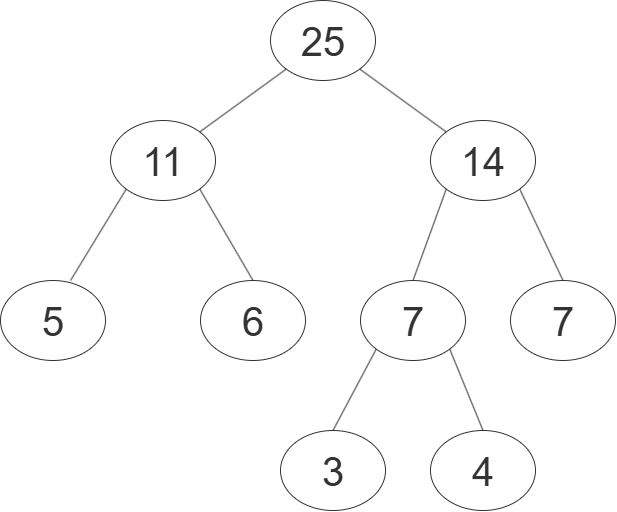

# 数据结构——第六章作业

**编程环境**：Windows11 vscode MinGW64 C++14


## problem4

### 题目描述

设计利用栈而不是递归对二叉树进行后序遍历的算法。

### 算法设计思路

递归实现的后序遍历：

```cpp
    void postOrderRec(Node *node)
    {
        if (node != nullptr)
        {
            postOrderRec(node->left);
            postOrderRec(node->right);
            cout << node->data << " ";
        }
    }
```

也即是先对左右子树完成后序遍历之后再访问当前节点。左子节点永远是优先访问的。

考虑入栈顺序与条件：
- 每访问一个新的节点就入栈；
- 后序遍历先访问左子节点，再访问右子节点，故每个节点的左子节点（非空）优先入栈，直到左子节点为空姐点
- 当前节点的所有左子节点都处理好了，判断右子节点，如果非空则进栈，并且重复上述步骤

什么时候出栈呢？如果当前节点是根节点了当然要出栈；另外如果当前节点的左右节点都已经完成了遍历，当然也要出栈，因此，我们需要记录左右节点是否已经都遍历完毕这一状态。

考虑出栈顺序与条件：

- 右节点是空出栈
- 右节点不为空，且右节点已经被访问过，出栈

### 代码实现

设计 `state` 结构体来记录节点和状态：

```cpp
struct state{
            Node* n;
            bool visited;
            state(Node* node, bool vis): n(node), visited(vis) {}
        };
```

其他的代码实现与上述思路一致。

### 测试与结果




## problem6

### 题目描述

设计一个算法判断给定的二叉树是否是完全二叉树。

### 算法设计思路

判断一棵树是否为完全二叉树，可以利用层次遍历的思想：
所有节点入栈，包括叶节点的子节点（nullptr），如果遇到一个空指针，那么之后的节点都必须是空指针，否则就不是完全二叉树。

### 测试与结果




## problem8

### 题目描述

写一个算法前序遍历一棵中序线索二叉树。

### 算法设计与思路

中序线索二叉树的特点是：如果一个节点的左子节点为空，那么它的左指针指向它的前驱节点；如果一个节点的右子节点为空，那么它的右指针指向它的后继节点。
因此，前序遍历中序线索二叉树的步骤如下：

- 对于当前节点，访问它并输出数据；
- 如果当前节点的左子节点不为空，递归前序遍历左子节点；
- 否则，如果当前节点的右子节点不为空，递归前序遍历右子节点；
- 否则，沿着右指针找到下一个非线索节点，继续前序遍历。

### 代码实现

1. 实现了线索二叉树数据结构
2. 根据上述思路实现了前序遍历算法

### 测试与结果



## problem9

### 题目描述

给定权值集合(5，6，3，7，4)，请构造对应的霍夫曼树

### 算法设计思路

使用优先级队列，找到其中最小的两个节点，合并成一个新节点，并将新节点重新插入队列中，直到队列中只剩下一个节点，即为霍夫曼树的根节点。

### 测试与结果

最终Huffman树的前序遍历与中序遍历：


最终Huffman树的图：



